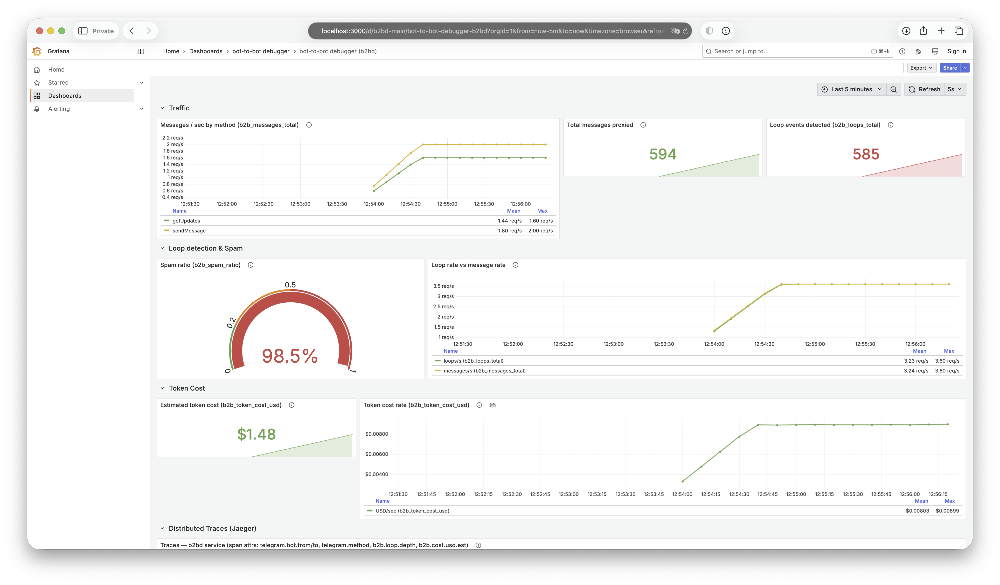
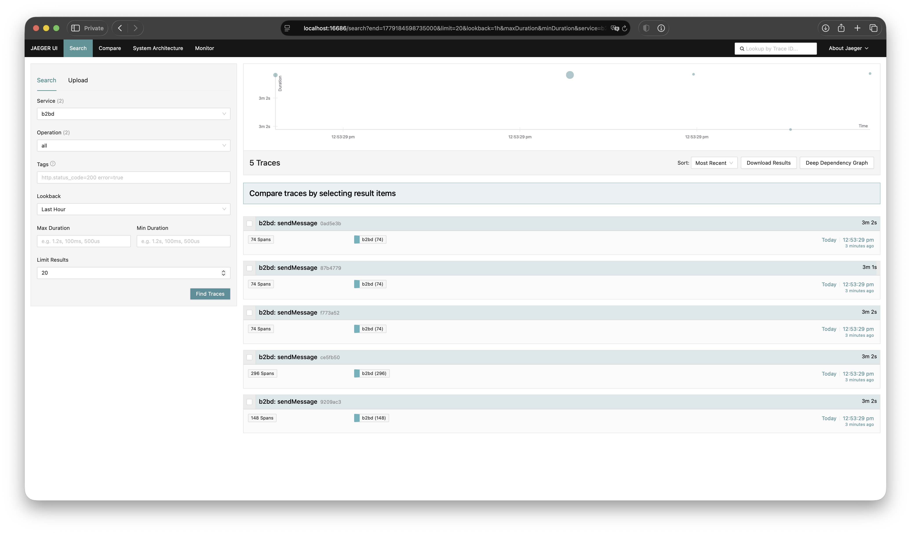
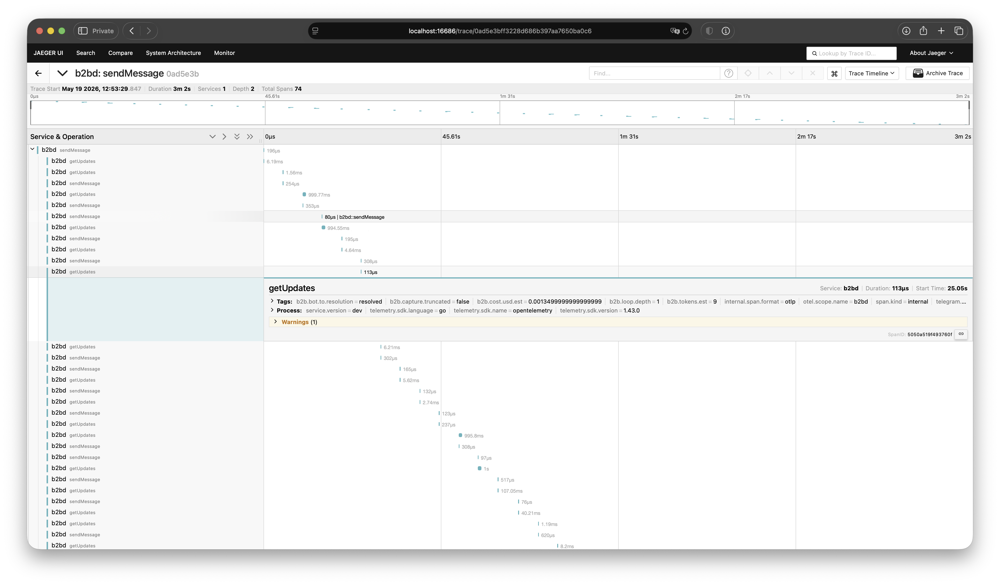

# b2bdbg — trace and debug Telegram bot-to-bot conversations

[](https://github.com/b2bdbg/b2bdbg/actions/workflows/ci.yml)
[](LICENSE)
[](https://goreportcard.com/report/github.com/b2bdbg/b2bdbg)
[](https://github.com/b2bdbg/b2bdbg/pkgs/container/b2bdbg)

A transparent reverse proxy that sits in front of the Telegram Bot API and turns
every **bot-to-bot** hop into an **OpenTelemetry** trace and **Prometheus**
metrics — for **debugging** multi-bot systems and AI agents whose only
**observability** today is one-sided Bot API logs. Single static binary, one
`docker compose up`, zero SDK changes (base-URL override only).

---

## TL;DR (30 seconds)

You run two or more Telegram bots that talk to **each other** — a router bot
hands off to a sales bot; an AI-agent bot calls a tool bot. When something goes
wrong (a message loops forever, a hand-off vanishes, an LLM bot quietly burns
tokens) the Telegram Bot API only shows you **one bot's side at a time**. There
is no view of the *conversation between the bots*.

**b2bdbg** is a small proxy you put in front of the Bot API. Your bots keep
working unchanged — you change exactly **one URL**. Every Bot API call now
becomes a trace you can open in Jaeger and a metric in Grafana, so you can
finally *see* bot↔bot traffic, catch loops, and estimate cost.

One binary. One `docker compose up`. No code changes. Apache-2.0.

---

## The mental model

**Without b2bdbg** — each bot is a black box; you only ever see one side:

```
   bot A  ───►  Telegram Bot API  ───►  bot B
     │               (opaque)             │
  A's logs                            B's logs
     ▲                                    ▲
     └──── two separate views ────────────┘
            never the edge  A → B
```

**With b2bdbg** — same traffic, one extra local hop, the edge is now visible:

```
   bot A ─┐                                ┌─► bot B
          ▼                                │
      ┌────────── b2bdbg proxy ──────────┐   │
      │ taps a copy, forwards bytes ───┼─► Telegram ─┘
      └───────────────┬────────────────┘
                       ▼
             one trace per conversation
              ┌────────┴─────────┐
          Jaeger              Grafana
        (A→B graph)     (loops, cost, rate)
```

Nothing about your bots changes. b2bdbg reads a *copy* of the traffic in flight;
the original bytes still go to real Telegram untouched.

---

## Picture this

A **router** bot dispatches refund requests to a **refund** bot. A retry bug
makes the router resend the same request whenever the refund bot is briefly
slow. Each bot's own logs look *fine* — each just sees normal sends and
receives. Meanwhile the two bots bounce the same message back and forth
hundreds of times, the LLM behind the refund bot burns tokens every turn, and
the first signal you get is **the bill**.

With b2bdbg in front: the repeated `(from → to, same text)` cycle is flagged on
the span as `b2b.loop.depth > 0`, counted in `b2b_loops_total`, and the running
token-cost estimate climbs on the Grafana panel — **while it is happening**,
not on the invoice next month.

---

## Is this for you?

**Likely yes if:**

- You run **two or more Telegram bots that message each other**
  (orchestrator/worker, router/specialist, human-in-the-loop gates).
- You have **AI-agent bots** whose only record today is each bot's own
  one-sided log.
- You have hit — or fear — a **loop / runaway** between bots.
- You want **per-conversation token-cost visibility** without instrumenting
  every bot.
- You want this with **no code change** and standard tooling (OpenTelemetry,
  Prometheus, Jaeger, Grafana).

**Probably not, if:**

- Your bots use **MTProto** (Pyrogram, Telethon, TDLib) — b2bdbg taps Bot API
  HTTP only.
- You have **one bot** and just want its own logs — the Bot API already gives
  you that.
- You need **trace replay, retention, or a policy firewall** today — out of
  scope here (see [Supported / not supported](#supported--not-supported)).

---

## The problem

When bot A hands a task to bot B, which calls bot C, the system is opaque by
construction:

- **Loops** — a retry or a misrouted reply bounces the same message between two
  bots and nothing flags it.
- **Lost hand-offs** — a message leaves A and never visibly arrives at B; there
  is no single place that shows the edge.
- **Invisible cost** — LLM-backed bots burn tokens per turn and you find out on
  the invoice.
- **One-sided logs** — the standard Bot API gives you each bot's own view, never
  the conversation. Cross-bot traces either don't exist or require invasive SDK
  changes in every language.

b2bdbg captures this at the transport layer, so no bot has to be modified to be
observed.



---

## What you get

- **The A→B graph in Jaeger** — one trace per conversation, one span per Bot API
  call, with the calling and (when known) receiving bot on every span.
- **Loop flags** — repeated `(from, to, text)` cycles within a sliding window
  are marked on the span (`b2b.loop.depth`) and counted (`b2b_loops_total`).
- **A token-cost *estimate*** — a `chars/4` heuristic times a rate you set;
  surfaced as a span attribute and a Prometheus counter. It is an estimate, not
  a bill.
- **Both ingestion modes, free** — long-polling (`getUpdates`) and webhook
  ingress (`/webhook/<label>`) run through the *same* capture and telemetry
  pipeline. Webhook is not a paid tier here.
- **No SDK changes** — point the bot's Bot API base URL at b2bdbg. That is the
  whole integration.

The full bot-to-bot conversation as a distributed trace in Jaeger — one span
per Bot API call across every bot:



Drilled into a single span — bot identities, loop depth, update id and cost
estimate as attributes:



---

## Quickstart

One command brings up the proxy plus a full trace/metrics stack:

```bash
cp .env.example .env && docker compose up -d
```

| Service | URL |
|---|---|
| b2bdbg proxy + `/metrics` + `/healthz` | http://localhost:8080 |
| Jaeger UI | http://localhost:16686 |
| Prometheus | http://localhost:9090 |
| Grafana (admin / admin) | http://localhost:3000 |

Host ports are set in `.env` (`B2BD_PORT`, `JAEGER_UI_PORT`,
`PROMETHEUS_PORT`, `GRAFANA_PORT`); the Grafana password is
`GRAFANA_ADMIN_PASSWORD` (defaults to `admin` — change it before exposing the
stack).

### Point your bot at the proxy

Set the Bot API base URL to b2bdbg instead of `https://api.telegram.org`. No code
changes beyond the base-URL override.

**python-telegram-bot (v20+)**

```python
from telegram.ext import ApplicationBuilder

app = (
    ApplicationBuilder()
    .token("YOUR_BOT_TOKEN")
    .base_url("http://localhost:8080/bot")
    .build()
)
```

**aiogram (v3)**

```python
from aiogram import Bot
from aiogram.client.session.aiohttp import AiohttpSession

session = AiohttpSession(api="http://localhost:8080/bot{token}/{method}")
bot = Bot(token="YOUR_BOT_TOKEN", session=session)
```

**go-telegram-bot-api (v5)**

```go
import tgbotapi "github.com/go-telegram-bot-api/telegram-bot-api/v5"

bot, err := tgbotapi.NewBotAPIWithClient(
    "YOUR_BOT_TOKEN",
    "http://localhost:8080/bot%s/%s",
    http.DefaultClient,
)
```

### See the demo bots' traffic in the compose Jaeger/Grafana

To watch a real multi-bot conversation flow through the composed stack — no
real tokens, no internet — start the full stack and the demo profile:

```bash
cp .env.example .env
make compose-demo
```

`make compose-demo` runs `docker compose --profile demo up --build` with
`B2BD_TELEGRAM_BASE_URL=http://support-team-demo:8081`. It builds a small,
separate demo image (`Dockerfile.demo`) and starts the five support-team bots
in *external-proxy mode*: every bot↔bot Bot API call is routed through the
composed `b2bdbg` service, and the demo container also serves an in-process mock
Telegram on `:8081` that the composed b2bdbg uses as its upstream. Then:

- **Jaeger** — open http://localhost:16686, select service **b2bdbg**, click
  **Find Traces**. You will see a multi-hop conversation trace including one
  span with `b2b.loop.depth > 0` from a simulated retry bug.
- **Grafana** — open http://localhost:3000 (admin / admin), open the **b2b**
  dashboard: `b2b_messages_total` and `b2b_loops_total` advance.

`make compose-demo` is a single ~6 s burst, so the per-second **rate** panels
decay back to zero shortly after — fine for a quick look, but for **dashboard
screenshots** run sustained traffic instead:

```bash
make compose-demo-traffic   # repeats the scripted conversation for ~15m; Ctrl-C to stop
```

The dashboard defaults to a `now-15m` window with 5 s auto-refresh; with live
traffic every panel (rate timeseries, cumulative stats, spam-ratio gauge, live
Jaeger traces) stays populated. See `examples/support-team/README.md` for the
per-panel guide. `make compose-demo` / `make compose-smoke` are unaffected.

Equivalent without Make:

```bash
B2BD_TELEGRAM_BASE_URL=http://support-team-demo:8081 \
  docker compose --profile demo up --build
```

The plain `docker compose up -d` never builds or starts the demo (it is gated
behind the `demo` profile), so the default path stays lean.

### Or see it work with zero setup, no Docker

```bash
make example
```

Runs the offline support-team demo entirely **in one process**: five
deterministic bots, an in-process b2bdbg proxy, and an in-memory mock Telegram
backend — no Docker, no real tokens, no internet. Spans print to **stdout** as
JSON (this in-process proxy has its own private Prometheus registry and does
*not* reach the composed Jaeger/Prometheus/Grafana). It includes one span with
`b2b.loop.depth > 0` from a simulated retry bug. Set `B2BD_OTEL_ENDPOINT` to
forward those stdout spans to an OTLP/gRPC collector instead.

---

## How it works

```
  Bot processes
      │  HTTP (base URL = http://localhost:8080)
      ▼
  ┌─────────────────────────────────────────────┐
  │  b2bdbg  (internal/server, :8080)              │
  │                                              │
  │  internal/proxy ───────────► api.telegram.org│
  │     │  tap req+resp bodies (≤ 1 MiB)         │
  │     │  webhook ingress: /webhook/<label>     │
  │     ▼                                        │
  │  internal/capture (Store)                    │
  │    • parse Bot API method                    │
  │    • correlate by (chat_id, thread_id)       │
  │    • bot identity via getMe (BotRegistry)    │
  │    • loop detection                          │
  │     │  capture.Listener.OnEvent              │
  │     ▼                                        │
  │  internal/telemetry (Sink)                   │
  │    • OTel span per event ──► OTLP / stdout   │
  │    • Prometheus counters ──► /metrics        │
  └─────────────────────────────────────────────┘
            │                    │
         Jaeger              Prometheus
            └──────── Grafana ───┘
```

The proxy forwards bytes transparently and taps a bounded copy of each request
and response body. The capture layer parses the Bot API method, correlates the
exchange into a conversation keyed by `(chat_id, thread_id)`, resolves bot
identity from `getMe` responses it has already seen, and runs loop detection.
The telemetry sink turns each correlated event into one OTel span (all spans for
a conversation share one trace) and updates the Prometheus collectors. Traces
export to an OTLP/gRPC endpoint when configured, otherwise pretty-printed to
stdout — so the binary is useful with no external services.

---

## Ingestion modes

Both modes funnel through the same per-update parser
(`capture.parseInboundUpdate`), so the captured A→B edge, loop-detection input,
conversation correlation, span, and metrics are identical regardless of how the
update arrived.

- **Long-polling** — bots call `getUpdates` through the proxy as their API base
  URL. No bot-side configuration beyond the base-URL override. When Telegram
  batches several updates into one poll response, each update produces its own
  span.
- **Webhook ingress** — configure one route per bot. Telegram POSTs updates to
  `/webhook/<label>` on b2bdbg; b2bdbg captures the update and forwards the body to
  the route's `target` (the bot's own server).

```yaml
webhook_routes:
  - label: "router-bot"             # mounted at /webhook/router-bot
    token: "123456:AAAA..."         # used only to derive the token hash
    target: "http://localhost:4000" # the bot's own update handler
    secret_token: "shared-secret"   # optional; see below
```

If `secret_token` is set, b2bdbg rejects any delivery whose
`X-Telegram-Bot-Api-Secret-Token` header does not match (HTTP 401, not
forwarded). The raw token is never in the URL or logs — only the URL-safe label
appears in the path. Point the bot's `setWebhook` URL at
`http://<b2bdbg-host>:8080/webhook/<label>`.

---

## Configuration

Precedence: **CLI flags > `B2BD_*` environment variables > YAML file**. If the
config path does not exist, b2bdbg runs on flags/env alone.

| YAML key | Flag | Env var | Default | Description |
|---|---|---|---|---|
| `listen_addr` | `--listen` | `B2BD_LISTEN_ADDR` | `:8080` | TCP address the server binds to |
| `telegram_base_url` | `--telegram-url` | `B2BD_TELEGRAM_BASE_URL` | `https://api.telegram.org` | Upstream Telegram Bot API base URL |
| `otel_endpoint` | `--otel-endpoint` | `B2BD_OTEL_ENDPOINT` | _(empty)_ | OTLP/gRPC endpoint (e.g. `localhost:4317`); empty → stdout exporter |
| `log_level` | `--log-level` | `B2BD_LOG_LEVEL` | `info` | Minimum log level: `debug` \| `info` \| `warn` \| `error` |
| `shutdown_timeout` | — | `B2BD_SHUTDOWN_TIMEOUT` | `15s` | Graceful-shutdown drain window (Go duration string) |
| `cost_per_k_tokens` | — | `B2BD_COST_PER_K_TOKENS` | `0` | Estimated USD per 1 000 tokens; `0` disables cost accumulation |
| `body_cap_bytes` | — | `B2BD_BODY_CAP_BYTES` | `1048576` (1 MiB) | Max request/response body bytes parsed for capture per exchange. The full body is still forwarded transparently; bodies over the cap set `b2b.capture.truncated`. Must be `>= 1024` |
| `debug_endpoints` | — | `B2BD_DEBUG_ENDPOINTS` | `false` | Opt-in local-only `GET /debug/registry` (bot id↔hash + counts; never raw tokens). Disabled → route 404s with zero overhead. Bind to a trusted/loopback interface when enabled |
| `webhook_routes` | — | per-route env (below) | `[]` | Inbound webhook ingress routes |

Other flags: `--config` (path to YAML, default `config.yaml`), `--version`,
`--help`. There is no environment override for the `webhook_routes` list itself;
configure the list in YAML and inject per-route secrets via env vars.

**Per-route secret env overrides.** To keep tokens out of the YAML file, set
`B2BD_WEBHOOK_TOKEN_<LABEL>` and `B2BD_WEBHOOK_SECRET_<LABEL>`, where `<LABEL>`
is the upper-cased label with `-` replaced by `_` (e.g. `router-bot` →
`B2BD_WEBHOOK_TOKEN_ROUTER_BOT`). When set, the env value takes precedence over
the YAML value for that route. Each route's `label` must match
`[A-Za-z0-9_-]+` and be unique; `target` must be an `http(s)://` URL; `token`
is required (used only to derive the hash).

Copy `config.example.yaml` to `config.yaml` and adjust, or pass `--config`.

### Subcommand

`b2bdbg healthcheck [--listen <addr>] [--config <path>]` performs an HTTP GET to
the local `/healthz` and exits `0` only on a `200` whose body contains `ok`. It
is used as the container healthcheck (the distroless image has no shell).

---

## OTel span attributes

One span per Bot API call (or per update in a batched poll / per webhook
delivery). Span name = the Bot API method name.

| Attribute | Type | Description |
|---|---|---|
| `telegram.bot.from` | string | First 16 hex chars of SHA-256 of the calling bot's token |
| `telegram.bot.to` | string | Same form for the recipient bot; **set only when the recipient is a bot already seen via `getMe`**, otherwise left empty (never faked) |
| `b2b.bot.to.resolution` | string | Why `telegram.bot.to` is/isn't set. Closed enum: `resolved` (set; recipient is a known bot), `unknown_getme_not_seen` (numeric chat_id that could be a bot but its `getMe` was never observed), `non_bot_chat` (human/group/channel — not applicable), `string_chat_id` (`@username`/channel string — no hash derivable). Non-empty `telegram.bot.to` iff `resolved` |
| `telegram.method` | string | Bot API method name (e.g. `sendMessage`) |
| `telegram.chat.id` | int64 | Telegram chat identifier |
| `telegram.msg.id` | int64 | Telegram message identifier |
| `telegram.text.len` | int64 | Byte length of the message text |
| `b2b.loop.depth` | int | `0` = no loop; positive = how many steps back the repeat was found |
| `b2b.tokens.est` | int64 | Estimated token count (`chars / 4`, minimum 1 for non-empty text) |
| `b2b.cost.usd.est` | float64 | Estimated cost (`tokens / 1000 ×` configured rate); `0` when no rate is set |
| `b2b.capture.truncated` | bool | `true` only when the body tap actually hit the configurable body cap for this exchange, so the parsed fields may be incomplete (`false` otherwise; always emitted). The full body is still forwarded transparently |
| `telegram.update.id` | int64 | Telegram `update_id` for inbound events (`getUpdates` element / webhook). Emitted only when `> 0`; omitted for outbound sends |
| `telegram.media.kind` | string | `photo` \| `document` \| `video` for media messages (kept consistent with the media key). Omitted for text-only messages |

A span whose upstream HTTP status is `>= 400` is marked with OTel status
`Error`.

## Prometheus metrics

Exposed on `/metrics`. When no telemetry sink is configured, `/metrics` returns
a plain "metrics disabled" body instead.

| Metric | Type | Labels | Description |
|---|---|---|---|
| `b2b_messages_total` | counter | `method` | Total correlated capture **events**, partitioned by Bot API method. One increment per parsed update — a batched `getUpdates` of N updates adds N; calls that produce no event (e.g. `getMe`) add 0. Not a count of upstream HTTP calls |
| `b2b_loops_total` | counter | — | Total loops detected |
| `b2b_spam_ratio` | gauge | — | loops ÷ messages, recomputed each event over the current process run |
| `b2b_token_cost_usd` | counter | — | Cumulative estimated LLM cost in USD |

Go runtime and process collectors are also registered in the same registry.

---

## Security

Bot tokens reach the proxy two ways: in the request path (long-poll) or from
your config/env (webhook routes) — so at rest the raw webhook token lives in
the YAML/environment you control, exactly like any service credential. b2bdbg
itself does not persist it: the token is hashed (SHA-256, first 16 hex chars)
on entry and only the hash is held in memory and written to spans/logs. The
raw value is never logged, never emitted to telemetry, and never serialised to
the trace store; error-log URLs have the token segment redacted; webhook paths
carry only the URL-safe label, never the token.

## Bounded memory

Nothing grows without bound:

- Conversations live in an LRU cache (default cap **10 000**) with TTL eviction
  (default **30 min** after the last event).
- The loop-detection window per conversation is bounded (default **20** entries,
  pruned after **5 min**).
- The bot-identity registry is FIFO-capped (default **1 000** known bots).
- The per-conversation OTel trace-context index is evicted in lock-step with the
  conversation store, so it cannot outlive its conversations.

## Supported / not supported

**Supported:** transparent proxy in front of the Telegram Bot API; long-polling
and webhook ingress (both free in this OSS core); OTLP/gRPC or stdout trace
export; Prometheus metrics; loop detection; token-cost estimation; the offline
`make example` demo.

**Not supported / not claimed:**

- **MTProto clients** (Pyrogram, Telethon, TDLib) — b2bdbg intercepts Bot API
  HTTP traffic only.
- **Trace replay & retention, policy/firewall/rate-limiting, hosted
  multi-tenant** — not in this repo. These are a planned, separate commercial
  product. Long-polling *and* webhook ingestion remain part of this free OSS
  core. Watch [github.com/b2bdbg/b2bdbg](https://github.com/b2bdbg/b2bdbg).

For the full, code-backed list of scope boundaries (MTProto, `bot.to`
resolution, body cap, cost estimate, loop detection, spam ratio, webhook
secret), see **[docs/limitations.md](docs/limitations.md)**.

## How it compares

| Approach | Sees the A→B edge? | Code change per bot? | Cross-language? | Cost estimate? |
|---|---|---|---|---|
| Raw Telegram Bot API logs | No — one bot's side only | — | — | No |
| OpenTelemetry SDK in every bot | Only if every bot is instrumented the same way | Yes — in each bot, each language | Hard — N SDKs to keep in sync | Only if you build it |
| General APM / app logging | Per-process, not the bot↔bot conversation | Usually yes | Varies | No |
| **b2bdbg** | **Yes — at the transport, every hop** | **No — base-URL override only** | **Yes — language-agnostic** | **Yes — estimate, configurable rate** |

b2bdbg is not an APM replacement. It adds the one view none of the above gives
you for free: the **bot-to-bot conversation itself**.

## FAQ

**Does b2bdbg see or store my bot token?**
The token transits the proxy (it is in the Bot API path) and, for webhook
routes, sits in your own config/env like any credential. b2bdbg hashes it on
entry (SHA-256, first 16 hex chars); only the hash is held in memory or written
to spans/logs. The raw token is never logged, never exported to telemetry,
never written to the trace store; error-log URLs are redacted. See
[Security](#security).

**Do I have to change my bot's code?**
One line: point the Bot API base URL at b2bdbg instead of
`https://api.telegram.org`. No SDK, no library, no rebuild.

**Which frameworks work?**
Any HTTP Bot API client that lets you override the base URL —
python-telegram-bot, aiogram, grammY, Telegraf, go-telegram-bot-api, and
others. Per-library snippets in [docs/frameworks.md](docs/frameworks.md).

**Telethon / Pyrogram / TDLib?**
No. Those speak MTProto, not the HTTP Bot API. b2bdbg taps Bot API HTTP only.

**Is webhook support a paid tier?**
No. Long-polling *and* webhook ingress both run through the same capture
pipeline in this OSS core, free.

**Will it slow my bots down?**
It is a transparent reverse proxy: bytes are forwarded as-is and only a
*bounded copy* (default ≤ 1 MiB) is tapped out-of-band for parsing. One extra
local hop, no body rewriting.

**Is the token cost a real bill?**
No — it is an *estimate* (`chars/4` heuristic × a rate you configure). The
default rate is `0`, so cost stays `0` until you set one. It is for spotting
runaway trends, not accounting.

**Does it require Jaeger / Prometheus?**
No. With no OTLP endpoint configured it pretty-prints spans to stdout and still
serves `/metrics`. The bundled `docker compose` adds Jaeger + Prometheus +
Grafana for the full picture.

**Is it self-hosted? Does data leave my network?**
Fully self-hosted. b2bdbg forwards to Telegram and exports traces/metrics only to
the endpoints you configure. Nothing else phones home.

## Build & distribution

Single binary, CGO disabled, distroless non-root Docker image. `make build`,
`make test`, `make example`; goreleaser cross-compiles linux and darwin on
amd64 and arm64.

`make compose-smoke` is the end-to-end gate (brings the stack up, generates
traffic, asserts Jaeger + Prometheus, tears down). It needs **Docker, Docker
Compose v2, `curl`, and `jq`** on PATH. Run `make release-check` (tests, lint,
compose-smoke, goreleaser snapshot) before tagging a release.

---

## License

Apache-2.0. See [LICENSE](LICENSE).

## Contributing

See [CONTRIBUTING.md](CONTRIBUTING.md). Security policy:
[SECURITY.md](SECURITY.md). More docs: [docs/quickstart.md](docs/quickstart.md),
[docs/architecture.md](docs/architecture.md),
[docs/span-schema.md](docs/span-schema.md),
[docs/frameworks.md](docs/frameworks.md) (per-library base-URL setup),
[docs/limitations.md](docs/limitations.md),
[docs/e2e-testing.md](docs/e2e-testing.md) (opt-in real-Telegram test).

## Keywords

Telegram bot-to-bot proxy, Telegram bot debugging, debug Telegram bots,
Telegram multi-bot system, OpenTelemetry Telegram bot tracing, distributed
tracing Telegram bots, bot loop detection, infinite loop between bots,
Prometheus bot metrics, Grafana Telegram dashboard, Jaeger Telegram traces,
Telegram bot observability, AI agent communication tracing, LLM agent token
cost monitoring, multi-agent debugging, Telegram Bot API reverse proxy,
python-telegram-bot / aiogram / grammY observability, bot-to-bot conversation
logging, self-hosted Telegram bot monitoring.
